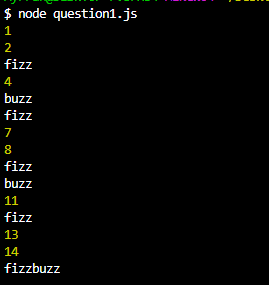
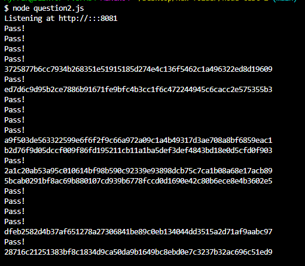

# node-test-2
Test for NodeJS (RedSquare)


## Versioning
- NodeJS v20.9.0


## Dependencies
- "axios": "^1.6.2",
- "dotenv": "^16.3.1",
- "express": "^4.18.2"


## How to run
1. Download or clone the repository.
2. Open up a terminal/cmd in the directory extracted to.
3. Run question 1.
```
node .\question1.js
```
4. Specify PORT if needed in .env file.
5. Start the application for Question 2 by running 
```
node .\question2.js
```


## Sending Request for Question 2
1. Open up any browser.
2. Enter the enpoint path with correct port (set to 8081 by default).
```
http://localhost:8081/endpoint1
http://localhost:8081/endpoint2
http://localhost:8081/endpoint3
```


## Description
### Question 2 - Endpoint 1
- Always sends a success response with random hash after a 1 second delay. 
- **Note**: Hashes are technically not unique as the combination of fixed set of characters of a fixed length is finite while the number inputs that can be hashed are infinite. However, for most usecases that requires hashing, the hash value is practically unique as the chances of hitting a repeating hash value is extremely slim.

### Question 2 - Endpoint 2
- Sends a request to endpoint 1.
- Returns a success response if last character is an odd number, else returns a 400 response.

### Question 2 - Endpoint 3
- Runs a loop that will send a request to endpoint 2 every 1 second (almost, as sending the request itself has a tiny processing overhead).
- The loop will not wait for the request to resolve, the response of the request is handled in callback functions.


## Sample Outout
1. Question 1


2. Question 2


